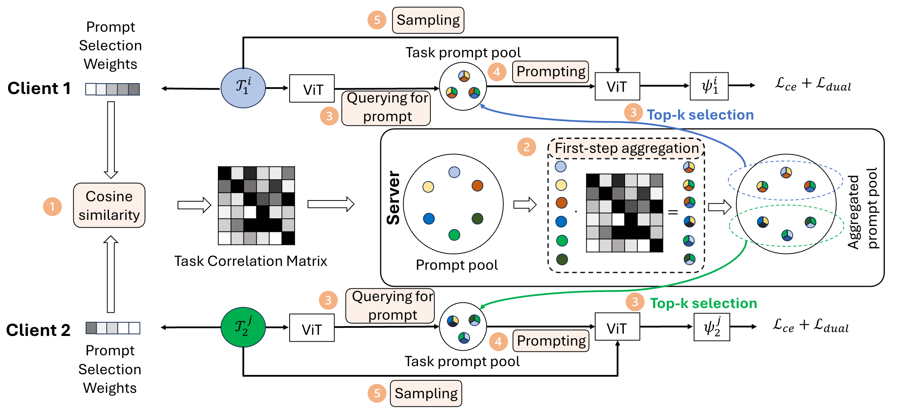

##  <font color=Green>Powder</font>: Federated Continual Learning via <font color=Green>P</font>rompt-based Dual Kn<font color=Green>ow</font>le<font color=Green>d</font>ge Transf<font color=Green>er</font>
PyTorch code for the ICML 2024 paper:\
**Federated Continual Learning via Prompt-based Dual Knowledge Transfer**\
*Hongming Piao, Yichen Wu, Dapeng Wu, Ying Wei* \
International Conference on Machine Learning (ICML), 2024

<p align="center">

</p>

## Abstract
In Federated Continual Learning (FCL), the challenge lies in effectively facilitating knowledge transfer and enhancing the performance across various tasks on different clients. Current FCL methods predominantly focus on avoiding interference between tasks, thereby overlooking the potential for positive knowledge transfer across tasks learned by different clients at separate time intervals. To address this issue, we introduce a Prompt-based Knowledge Transfer FCL algorithm, called Powder, designed to effectively foster the transfer of knowledge encapsulated in prompts between various sequentially learned tasks and clients. Furthermore, we have devised a unique approach for prompt generation and aggregation, intending to alleviate privacy protection concerns and communication overhead, while still promoting knowledge transfer. Comprehensive experimental results demonstrate the superiority of our method in terms of reduction in communication costs, and enhancement of knowledge transfer.

## Setup
 * Install anaconda: https://www.anaconda.com/distribution/
 * Set up conda environment with python 3.8, ex: `conda create --name powder python=3.8`
 * `conda activate powder`
 * `cd src/`
 * `pip install -r requirements.txt` 
 
## Datasets
 * Create a folder `src/data/`
 * **ImageNet-R**: retrieve from: https://github.com/hendrycks/imagenet-r
 * **DomainNet**: retrieve from: http://ai.bu.edu/M3SDA/

## Training
All commands should be run under the `src/` directory. We provide the commands for our method Powder in `powder_job.slurm`, commands for prompt-based methods in `prompt_job.slurm`, commands for not prompt-based methods in `noprompt_job.slurm`. Here we take Powder on ImageNet-R as an example:
 * Run the FCL process of Powder with the command:
    ```
    python fl_main_hard.py --device 0 --global_update_lr 100 --img_size 224 --numclass 500 --class_per_task 20 --dataset ImageNet_R --easy 0 --tasks_global 3 --num_clients 5 --epochs_global 15 --local_clients 5 --learning_rate 0.005 --prompt_flag codap_2d_v2 --method cprompt_powder_v2 --batch_size 64 --prompt_param 25 10 10 8 0 0 6 10 8 --epochs_local 10 --seed 2021
    ```
 * Get the FCL results in `src/training_log/cprompt_powder_v2/seed2021/log_tar_0.005.txt`
 * Run the single task training process of Powder with the command:
    ```
    python fl_main_hard.py --device 0 --global_update_lr 100 --img_size 224 --numclass 500 --class_per_task 20 --dataset ImageNet_R --easy 0 --tasks_global 3 --num_clients 5 --epochs_global 15 --local_clients 5 --learning_rate 0.005 --prompt_flag codap_2d_v2 --method cprompt_powder_v2_direct --batch_size 64 --prompt_param 25 10 10 8 0 0 6 10 8 --epochs_local 10 --seed 2021
    ```
 * Get the single task training results in `src/training_log/cprompt_powder_v2_direct/seed2021/log_tar_0.005.txt`
 * Compute the five metrics in our benchmark with `src/benchmark_metrics.py`.
    1. Note that 2 clients switch to new tasks every 3 rounds (start from round 0), thus we compute the five metrics every 3 rounds. First, please set the finished task id in `task_list_forward` and `task_list_backward`. For example:
        ```
        task_list_forward = [{2:[1,2], 5:[0,4], 8:[6,3], 11:[16,7], 14:[10,14,18,21,22]}]
        task_list_backward = [{2:[1,2], 5:[0,4], 8:[6,3], 11:[16,7], 14:[]}]
        ```
        where `[1,2]` means task 1 and task 2 finished after round 2.
    
    2. Set the path of FCL results and single task training results in `pathes` and `pathes_notran`.
    
    3. Run the command and you will get the results:
        ```
        python benchmark_metrics.py
        ```
Please refer to `src/option.py` for more introductions on arguments.

## Other Related Projects

- [L2P](https://github.com/google-research/l2p)
- [DualPrompt](https://github.com/google-research/l2p)
- [CODA-Prompt](https://github.com/GT-RIPL/CODA-Prompt)
- [Fed-CPrompt](https://github.com/grbagwe/Fed-CPrompt)
- [GLFC](https://github.com/conditionWang/FCIL)
- [FedWeIT](https://github.com/wyjeong/FedWeIT)
- [CFeD](https://github.com/lianziqt/CFeD)
- [FedSpace](https://github.com/LTTM/FedSpace)

We would like to express our heartfelt gratitude for their contribution to our project.

## Acknowledgement
This work was supported by the Innovation and Technology Fund (No. MHP/034/22) funded by the Innovation and Technology Commission, the Government of the Hong Kong Special Administrative Region.

## Citation
**If you found our work useful for your research, please cite our work**:
    
    @inproceedings{
    piao2024federated,
    title={Federated Continual Learning via Prompt-based Dual Knowledge Transfer},
    author={Hongming Piao and Yichen Wu and Dapeng Wu and Ying Wei},
    booktitle={Forty-first International Conference on Machine Learning},
    year={2024},
    url={https://openreview.net/forum?id=Kqa5JakTjB}
    }

